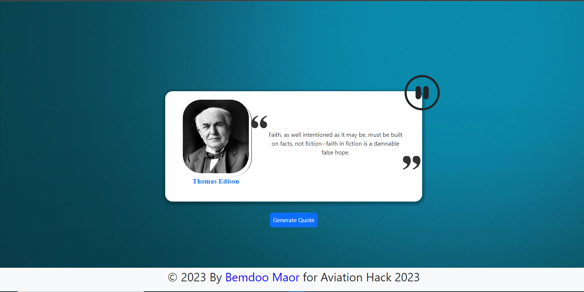

# Quotes App

This is a Quotes App which generates popular quotes to keep you motivated. It utilizes the [api.quotable.io](https://api.quotable.io) api and my custom [authors.json](authors.json) api

## What it does

- It generates popular quotes
- It saves previous quotes in session Storage
- It converts quotes to speech
- It also utilizes my custom [api](authors.json)
- It uses debounce when generating Quotes for 2secs

## Technologies, Languages and Tools Used

- HTML5
- CSS3
- Javascript(ES6)

## Why I used them

I used the Tech Stack above to keep things simple and fix bugs easily

## Challenges: I faced, I'm aware of and hope to fix

- First of all this whole App was not what I planned to build for the Hackathon
- I wanted to make an app that sends motivational quotes every day at a particular time but I didn't have the resources and skills
- The App is not very responsive
- My custom [api](authors.json) is not complete

## How to install and Run the Project

- Fork the project and clone it to you local machine
```bash
git clone <repo>
```
- Redirect to the project directory and open with *Live Server*

## Demo

<video autoplay loop muted>
  <source src="Img/screen-record.mp4">
</video><br>

<br>

**[Live Demo](https://bemdoom-aviation-hack-2023.vercel.app)**

## 👨‍💻Author

Github: **[MaorBemdoo](https://github.com/MaorBemdoo)**

## Contributing

Future Pull request and issues are welcome, by the way there is an open [issue](https://github.com/MaorBemdoo/Quotes-App/issues/11)

## Support

Give this repo a ⭐ if you liked it

## License

Thsi Project is **[MIT](LICENSE)** Licensed
